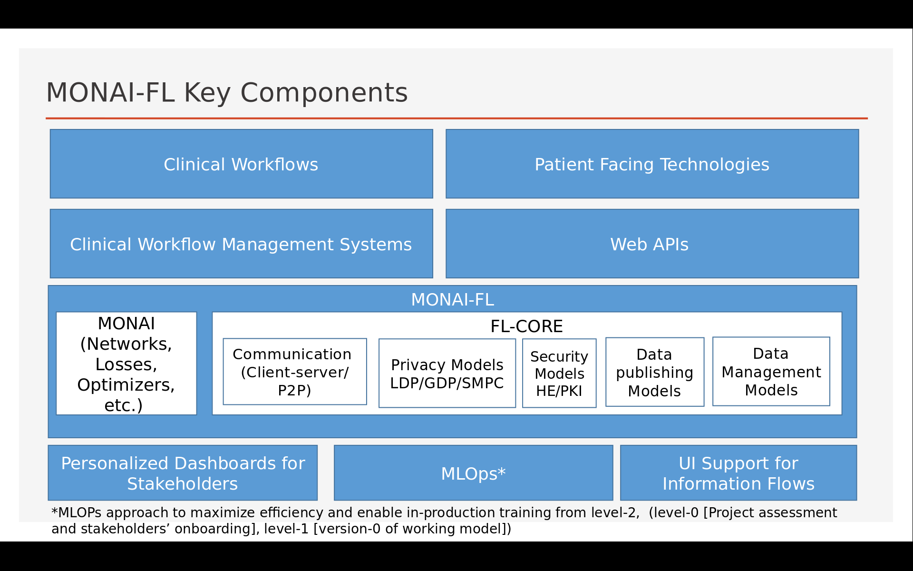

<!--
*** Thanks for checking out the Best-README-Template. If you have a suggestion
*** that would make this better, please fork the repo and create a pull request
*** or simply open an issue with the tag "enhancement".
*** Thanks again! Now go create something AMAZING! :D
***
***
***
*** To avoid retyping too much info. Do a search and replace for the following:
*** github_username, repo_name, twitter_handle, email, project_title, project_description
-->


<!-- PROJECT SHIELDS -->
<!--
*** I'm using markdown "reference style" links for readability.
*** Reference links are enclosed in brackets [ ] instead of parentheses ( ).
*** See the bottom of this document for the declaration of the reference variables
*** for contributors-url, forks-url, etc. This is an optional, concise syntax you may use.
*** https://www.markdownguide.org/basic-syntax/#reference-style-links
-->
<!--[![Contributors][contributors-shield]][contributors-url]
[![Forks][forks-shield]][forks-url]
[![Stargazers][stars-shield]][stars-url]
[![Issues][issues-shield]][issues-url]
[![MIT License][license-shield]][license-url]
[![LinkedIn][linkedin-shield]][linkedin-url]
-->


<!-- PROJECT LOGO -->
<br />
<p align="center">
  <a href="https://github.com/habibcomsats/monaifl">
    
  </a>

  <h3 align="center">MONAI-FL</h3>

  <p align="center">
    This repository contains the basic federated learning example of monai code considering substra's opener and algo classes.
    <!--<br />
    <a href="https://github.com/github_username/repo_name"><strong>Explore the docs »</strong></a>
    <br />
    <br />
    <a href="https://github.com/github_username/repo_name">View Demo</a>
    ·
    <a href="https://github.com/github_username/repo_name/issues">Report Bug</a>
    ·
    <a href="https://github.com/github_username/repo_name/issues">Request Feature</a>
  </p>
    -->
</p>


<!-- TABLE OF CONTENTS -->
<details open="open">
  <summary><h2 style="display: inline-block">Table of Contents</h2></summary>
  <ol>
    <li>
      <a href="#about-the-project">About The Project</a>
      <ul>
        <li><a href="#built-with">Built With</a></li>
      </ul>
    </li>
    <li>
      <a href="#getting-started">Getting Started</a>
      <ul>
        <li><a href="#prerequisites">Prerequisites</a></li>
        <li><a href="#installation">Installation</a></li>
      </ul>
    </li>
    <li><a href="#usage">Usage</a></li>
    <li><a href="#roadmap">Roadmap</a></li>
    <li><a href="#contributing">Contributing</a></li>
    <li><a href="#license">License</a></li>
    <li><a href="#contact">Contact</a></li>
    <li><a href="#acknowledgements">Acknowledgements</a></li>
  </ol>
</details>


<!-- ABOUT THE PROJECT -->
## About The Project



Here's a blank template to get started:
**To avoid retyping too much info. Do a search and replace with your text editor for the following:**
`github_username`, `repo_name`, `twitter_handle`, `email`, `project_title`, `project_description`


### Built With

* []()
* []()
* []()


<!-- GETTING STARTED -->
## Getting Started

To get a local copy up and running follow these simple steps.

### Prerequisites

This is an example of how to list things you need to use the software and how to install them.
* npm
  ```sh
  npm install npm@latest -g
  ```

### Installation

1. Clone the repo
   ```sh
   git clone https://github.com/github_username/repo_name.git
   ```
2. Install NPM packages
   ```sh
   npm install
   ```


<!-- USAGE EXAMPLES -->
## Usage

Use this space to show useful examples of how a project can be used. Additional screenshots, code examples and demos work well in this space. You may also link to more resources.

_For more examples, please refer to the [Documentation](https://example.com)_


<!-- ROADMAP -->
## Roadmap

See the [open issues](https://github.com/github_username/repo_name/issues) for a list of proposed features (and known issues).


<!-- CONTRIBUTING -->
## Contributing

Contributions are what make the open source community such an amazing place to learn, inspire, and create. Any contributions you make are **greatly appreciated**.

1. Fork the Project
2. Create your Feature Branch (`git checkout -b feature/AmazingFeature`)
3. Commit your Changes (`git commit -m 'Add some AmazingFeature'`)
4. Push to the Branch (`git push origin feature/AmazingFeature`)
5. Open a Pull Request


<!-- LICENSE -->
## License

Distributed under the MIT License. See `LICENSE` for more information.


<!-- CONTACT -->
## Contact

Your Name - [@twitter_handle](https://twitter.com/twitter_handle) - email

Project Link: [https://github.com/github_username/repo_name](https://github.com/github_username/repo_name)


<!-- ACKNOWLEDGEMENTS -->
## Acknowledgements

* []()
* []()
* []()


<!-- MARKDOWN LINKS & IMAGES -->
<!-- https://www.markdownguide.org/basic-syntax/#reference-style-links -->
[contributors-shield]: https://img.shields.io/github/contributors/github_username/repo.svg?style=for-the-badge
[contributors-url]: https://github.com/github_username/repo_name/graphs/contributors
[forks-shield]: https://img.shields.io/github/forks/github_username/repo.svg?style=for-the-badge
[forks-url]: https://github.com/github_username/repo_name/network/members
[stars-shield]: https://img.shields.io/github/stars/github_username/repo.svg?style=for-the-badge
[stars-url]: https://github.com/github_username/repo_name/stargazers
[issues-shield]: https://img.shields.io/github/issues/github_username/repo.svg?style=for-the-badge
[issues-url]: https://github.com/github_username/repo_name/issues
[license-shield]: https://img.shields.io/github/license/github_username/repo.svg?style=for-the-badge
[license-url]: https://github.com/github_username/repo_name/blob/master/LICENSE.txt
[linkedin-shield]: https://img.shields.io/badge/-LinkedIn-black.svg?style=for-the-badge&logo=linkedin&colorB=555
[linkedin-url]: https://linkedin.com/in/github_username

Reference notebook

https://github.com/Project-MONAI/tutorials/blob/master/2d_classification/mednist_tutorial.ipynb

How to Install:
 - create conda environment with python 3.8
 - install monai
 - install grpcio
 - install grpc with python compiler
    - python -m pip install grpcio
    - python -m pip install grpcio-tools
 - install your system compatible pytorch version
 - install pandas
 - install numpy

Mount the dataset:
 This repository contains the demo dataset. If you are cloning this repository, you do not need to mount any dataset. Otherwise, you must execute the cell 5 from the reference notebook, extract the dataset at your preferred location and set the path in testmonai.py 

Running Server:
1. Open a new terminal
2. activate conda environment
3. $ cd monaifl (currently it is not dockerized)
4. $monaifl/python aggregator/coordinator/src/server.py

Running Client:
1. Open a new terminal
2. activate conda environment
3. cd monaifl 
4. python trainer/substra/testmonai.py

CAUTION: The server side code does not require any GPU installation but for the client side you must have a CUDA-enabled device to initiate the training. 

Please feel free to contact me at habibcomsats@gmail.com or mhrehman@ieee.org for any query, feedback, suggestion, or discussion.
